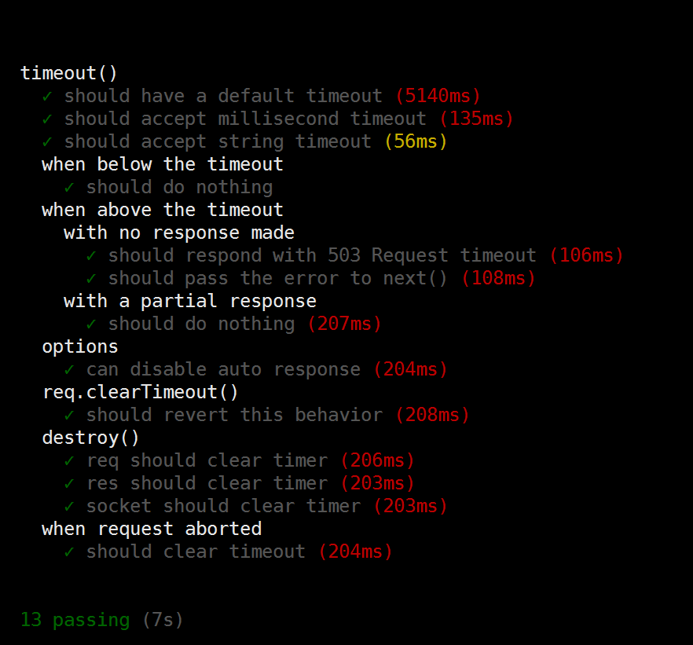

# connect-timeout analysis
## 前言  
该项目首先指定一个超时时间，当服务器向客户端发出请求时，如果超过这个时间还没有回应，就发出错误。
## 一. Readme文档    
### 1. 安装    
  $npm install connect-timeout
### 2. API  

   App.use(timeout('5s')) 
   当请求超过给定的超时时，库发出超时事件，节点继续处理缓慢的请求，直到它终止，即使您在超时回调中返回HTTP响应，缓慢的请求也将继续使用CPU和内存。为了更好控制CPU、内存、您可能需要查找很长时间的事件（第三方HTTP请求，磁盘I/O请求，数据库调用），并找到取消他们的方法，和/或关闭附加的套接字。 
   
### 3. 超时（时间，[选项]）    
  返回以time 毫秒为单位的超时的中间件。Time 也可以是ms模块接受的字符串。超时后，req发出‘timeout’。 
  
   **选项** 
   该timeout函数采用options可能包含以下任何键的可选对象。    
   >response  
   > 控制此模块是否会以转发错误的形式“回应”。如果true传递超时错误，next()以便您可以自定义响应行为。这个错误有一个.timeout属性以及.status == 503。这个默认为true。  
   
   >req.clearTimeout（）  
   >清除请求的超时时间。超时被完全删除，将来不会触发此请求。  
     
   >req.timedout  
   >true如果超时被解雇; false除此以外  
### 4.app.use([path], function)  
    app.use 加载用于处理http请求的middleware（中间件），当一个请求来的时候，会依次被这些 middlewares处理。执行的顺序是你定义的顺序。
### 5.中间件   
什么是中间件Middleware？  
  
中间件就是类似于一个过滤器的东西，在客户端和应用程序之间的一个处理请求和响应的方法，其实就是一个简单的JavaScript函数，它除了处理req和res请求外，还接收一个next函数来做流控制。  
  
next()用于调用下一个中间件，中间件是层叠的，上层中间件处理完当前任务后必修按照约定把处理机会转交给下层中间件。
由于中间件处理的工作方式，一旦这个模块将请求传递给下一个中间件（为了让你工作，它必须做），它不能再停止流动，所以你必须注意检查请求已超时，然后再继续处理请求。

##  二.文件解读  
### 1. package.json 文件中的依赖项  

 **http-errors 创建HTTP错误**  
>createError([status], [message], [properties])    
>status:503 作为数字状态码 503 暂停服务  
>message 错误信息，默认为该状态的节点文本  
>properties 要附加到对象的自定义属性  

**On-headers 响应即将写入标头时执行侦听器**  
>onHeaders（res，listener）  
>这将添加侦听器listener在发出标题时触发res。监听器通过responsecontext（this）传递对象。在发送给客户之前，头部被认为只发出一次。
当这个被多次调用时res，listeners被按照相反的顺序被触发。  

**On-finished HTTP请求关闭，完成或错误时执行回调**  
>onFinished（res，listener）  
>附加一个监听器来监听响应结束。响应完成后，侦听器只会被调用一次。如果响应完成了一个错误，第一个参数将包含错误。如果响应已经完成，则监听器将被调用。
>听到响应的结尾将被用于关闭与响应相关的事物，如打开的文件。
>监听器被调用为listener(err, res)。  

**ms 时间格式转换为毫秒**  
>如果提供一个数字ms，则返回一个带有单位的字符串  
>如果提供包含数字的字符串，它返回它作为一个号码（例如：它返回100对'100'）  
>如果用一个数字和一个有效单位传递一个字符串，则返回等价的毫秒数  
 
### 2. index.js 代码    

**(1)代码介绍**    

      Node.js的http模块可用非常方便地请求网络资源,只能等到系统自动超时才能做下一步，没有一个固定的时间，该代码则指定一个超时时间，如果到了指定的时间，还没建立连接，则报异常。   
     请求超时中间件，默认超时时间5000ms，可以清除这个时间通过req.clearTimeout()函数，超时的错误通过next（）函数传递。  
       
**（2）代码注释**[https://github.com/douoooou/connect-timeout/blob/master/index1.js](https://github.com/douoooou/connect-timeout/blob/master/index1.js)    
  
**（3）测试代码截图**    

     
  
**（4）代码分析问题**  
+ 项目的功能是什么？
> 指定一个超时时间，如果到了指定的时间，还没建立连接，则报异常。     
+ 项目类型是什么？  
> 模块  
+ 项目的入口文件是哪个？  
> index.js  
+ 项目的依赖项有哪些，各个依赖项都是做什么，有什么功能？  
> on-header on-finished ms http-error  
+ 代码模块中有哪些函数？各个函数都是做什么的？  
> timeout函数  返回一个超时的中间件   
> onTimeout 函数  连接超时时,返回错误，自定义响应方式  
+ 项目中用到自动化测试吗？用到自动化测试框架了吗？用的是哪个自动化测试框架？  
> 用到了自动化测试，mocha自动化测试。  

